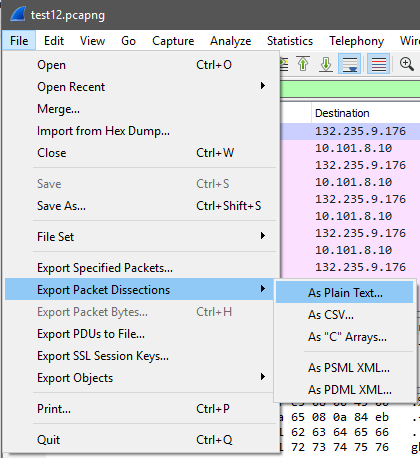
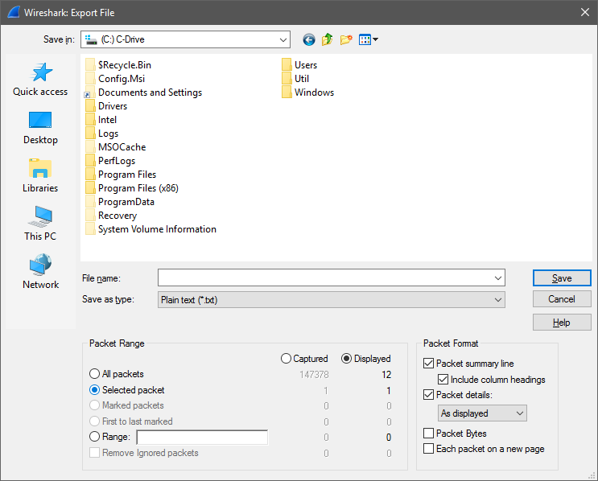

##Exporting Wireshark Packet Data for ECT Student Lab Reports

Most reports that students will write for this class will require the student to properly export packet data from Wireshark into a text format. They will use it to support answers in the lab reports. Taking screenshots of the Wireshark interface is an unacceptable method of displaying the packet data needed for lab reports. Wireshark supports a very easy to use EXPORT function that will save both the Summary Line and the Packet Details that you will want for every packet you use in your reports.

1. Must be working with a saved .PCAP file. Save live work to a file first if needed.

2. Open Wireshark and select the packet you wish to export to a text file.

3. Click on File menu and then select "Export Packet Dissections..." then as "As Plain Text" file... it should look something like this. (Ironically, I'll use screenshots from Wireshark to show it!)

3. This will open a sub-menu in Wireshark titled: Export Specified Packets

4. There are a few options that should be changed from the defaults to get the results you want. First you will want to change the radio button on the lower left side under Packet Range from "All Packets" to Selected Packet". This way you will only export the one packet you had selected in step 1.

5. On lower right side under "Packet Format" you will want to have the check box for "Packet summary line" checked. This will output the summary information seen as colored lines in top part of the main
Wireshark display.

6. Packet output in a lab report should **ALWAYS** have **at least** the packet summary line.